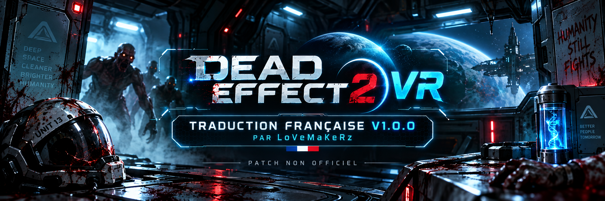
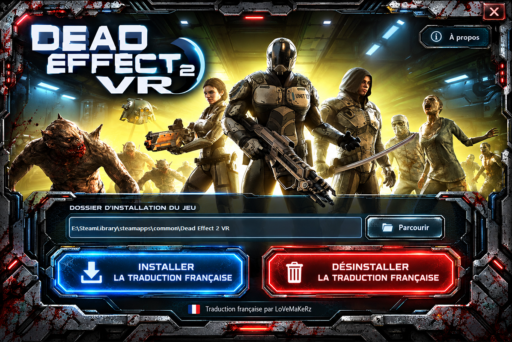
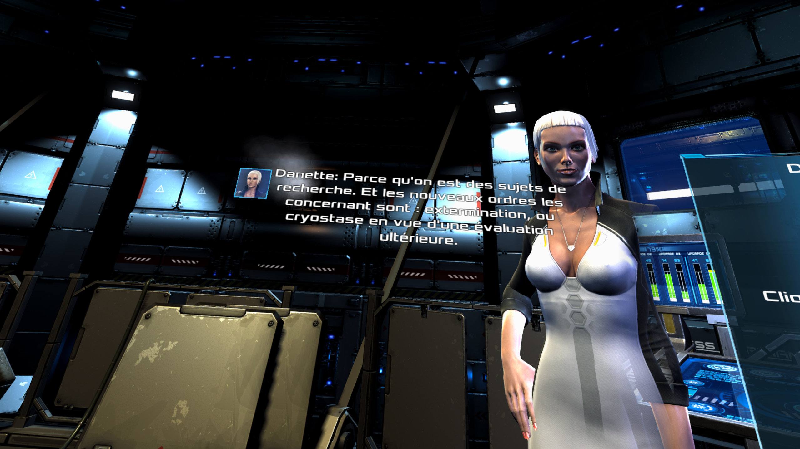

# Dead Effect 2 VR — Traduction française complète 🇫🇷



## Traduction française V1.0.0 par LoVeMaKeRz

Cette traduction française non officielle de **Dead Effect 2 VR** a pour objectif de rendre l’intégralité du jeu accessible en français, tout en conservant au maximum le ton, le contexte et l’ambiance de la version originale.

La traduction couvre notamment :

- les dialogues ;
- les sous-titres ;
- les menus et l’interface ;
- les options VR ;
- les missions et objectifs ;
- les objets et l’inventaire ;
- les implants ;
- les succès ;
- les tâches secondaires ;
- les e-mails et datapads ;
- les tutoriels ;
- les textes système ;
- les contenus de l’extension.

Les **voix restent en anglais**.

La traduction française a été réalisée par **LoVeMaKeRz**.

---

# État de la traduction

Version actuelle :

**V1.0.0**

Le corpus final contient :

- **10 960 clés de localisation**
- **10 957 textes français**
- **4 548 / 4 548 dialogues et sous-titres traduits**
- **0 texte anglais non vide connu sans traduction française**

Plusieurs passes complètes de QA ont été réalisées sur :

- les dialogues et leur contexte ;
- les accords homme/femme ;
- les variantes des personnages jouables ;
- les descriptions d’objets ;
- les missions et objectifs ;
- les tutoriels ;
- les e-mails et datapads ;
- les succès ;
- les textes système ;
- les placeholders ;
- les commandes `[Input:...]` ;
- les balises Unity ;
- les retours à la ligne ;
- les accents et caractères français ;
- les longueurs de sous-titres ;
- les incohérences terminologiques.

Le français est ajouté comme **cinquième langue native** du jeu.

Aucune langue existante n’est remplacée.

---

# Installation

Deux méthodes sont disponibles.

## Méthode recommandée — Installateur automatique

La méthode la plus simple consiste à utiliser l’installateur portable :

**DeadEffect2VR_FR_Installer_V1.0.0.exe**

Téléchargez-le depuis la section **Releases** de ce dépôt.

L’installateur ne s’installe pas dans Windows et ne crée aucun programme permanent.

Il permet simplement de :

- détecter automatiquement Dead Effect 2 VR ;
- sélectionner manuellement le dossier du jeu si nécessaire ;
- installer la traduction française ;
- désinstaller la traduction ;
- restaurer le fichier original du jeu.

### Installation

1. Téléchargez l’installateur.
2. Lancez :

   `DeadEffect2VR_FR_Installer_V1.0.0.exe`

3. Vérifiez que le dossier de Dead Effect 2 VR est correctement détecté.
4. Cliquez sur :

   **Installer la traduction française**

5. Attendez la confirmation de réussite.
6. Lancez Dead Effect 2 VR depuis Steam.
7. Sélectionnez **Français** dans les options du jeu si nécessaire.

L’installateur sauvegarde automatiquement le fichier original avant modification.

---



# Désinstallation avec l’installateur automatique

Relancez simplement :

`DeadEffect2VR_FR_Installer_V1.0.0.exe`

Puis cliquez sur :

**Désinstaller la traduction française**

Le fichier original du jeu sera restauré automatiquement.

---

# Installation manuelle Xdelta

Une version **Xdelta** est également disponible pour les utilisateurs qui préfèrent une installation manuelle ou qui téléchargent la traduction depuis NexusMods.

Cette version ne contient :

- aucun fichier original du jeu ;
- aucun exécutable ;
- aucun script ;
- aucun fichier propriétaire de Dead Effect 2 VR.

Elle contient uniquement le patch nécessaire à la traduction.

## Fichier à patcher

Dans le dossier du jeu :

```text
Dead Effect 2 VR
└── DeadEffect2_Data
    └── resources.assets
